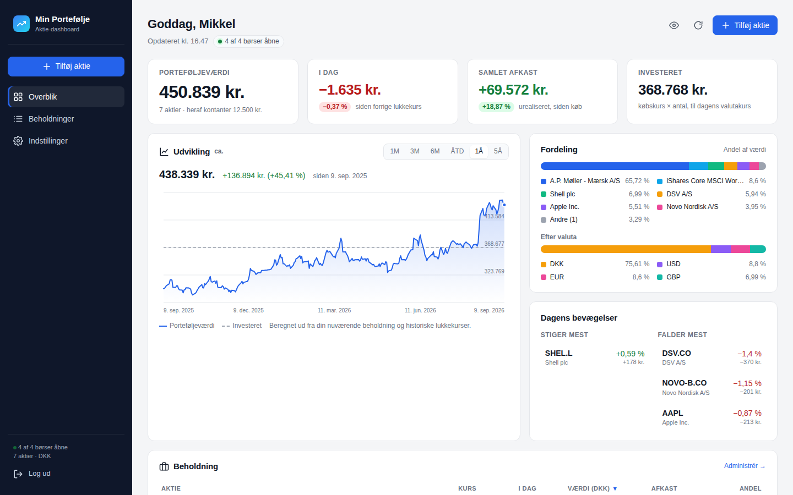

# Min Portefølje – aktie-dashboard

Et personligt, selv-hostet dashboard til din aktieportefølje. Du logger ind med én adgangskode og ser dine aktier med **live kurser fra Yahoo Finance**, dagens bevægelse, samlet afkast og fordeling – i DKK (eller en anden basisvaluta).



## Funktioner

- **Overblik på 3 sekunder**: porteføljeværdi, dagens ændring, samlet afkast og investeret beløb.
- **Beholdningstabel** med live kurs, dagens ændring, gns. købskurs, værdi, afkast og andel – sortérbar, med totaler.
- **Udvikling**: graf over porteføljens værdi (1M–5Å) med "investeret"-linje.
- **Fordeling** pr. aktie og pr. valuta samt **dagens største bevægelser**.
- **Detaljepanel** pr. aktie: dagens interval, 52-ugers interval, din position, valutakurs.
- **Tilføj aktier via søgning** ("novo", "mærsk", "apple" …) – danske børser vises først. Kurs og valuta hentes automatisk.
- **Køb til / Sælg** med automatisk vægtet gennemsnitskurs. Redigér og slet.
- **Flere valutaer**: DKK, USD, EUR, GBP (pence omregnes automatisk) m.fl. – alt summeres i din basisvaluta med dagens valutakurs.
- **Kontanter**: valgfrit beløb, så "Porteføljeværdi" matcher dit depot.
- **Live opdatering** hvert minut mens en børs er åben (pause når fanen er skjult).
- **Ærlige tal**: forældede kurser vises i gråt, aktier uden kurs holdes ude af totalerne, og "I dag" bliver til "Seneste handelsdag" når børserne er lukket.
- **Login** med adgangskode, "husk mig", brute-force-bremse, skift adgangskode og "log ud overalt".
- **Mørkt tema**, mobilvenligt layout (bundmenu + kort), "skjul beløb"-knap til toget, dansk talformat.
- **Sikkerhedskopi**: download/gendan som JSON. Serveren gemmer desuden de 5 seneste versioner automatisk.
- **Ingen afhængigheder**: kun Node.js. Intet build-step, intet framework. Data i en JSON-fil – eller i Upstash Redis på Vercel.

## Kom i gang

Kræver [Node.js](https://nodejs.org) 20 eller nyere.

```bash
git clone https://github.com/mikkelefrost/aktie-portfolio.git
cd aktie-portfolio
npm start
```

Åbn <http://localhost:3000>. Første gang bliver du bedt om at **oprette en adgangskode** – derefter er du logget ind og kan tilføje din første aktie.

Åbner du siden fra en *anden* maskine end den, serveren kører på (fx en server eller Docker på en NAS), skal du også indtaste den **opsætningsnøgle**, som serveren skriver i terminalen/loggen ved start. Det forhindrer, at en fremmed opretter adgangskoden før dig.

### Docker

```bash
docker compose up -d
```

Dashboardet kører på port 3000, og dine data ligger i Docker-volumen `aktie-data` (så de overlever genstart og opdateringer). Opsætningsnøglen ses med `docker compose logs`. Bruger du en bind-mount i stedet for volumen, skal mappen kunne skrives af uid 1000.

### Vercel (gratis hosting fra GitHub)

Appen kan køre som én serverless-funktion på [Vercel](https://vercel.com) med data i Upstash Redis:

1. **Importér repoet** i Vercel: *Add New → Project → Import* `aktie-portfolio`. Framework: *Other*. Deploy (siden viser en fejl indtil trin 2 og 3 er klaret).
2. **Database**: I projektet → *Storage → Create Database → Upstash Redis* (gratis tier). Vercel sætter selv `KV_REST_API_URL`/`KV_REST_API_TOKEN`.
3. **Miljøvariabler** under *Settings → Environment Variables*:
   - `DASHBOARD_PASSWORD` – din adgangskode (påkrævet; Vercel har ingen terminal at læse en opsætningsnøgle fra).
   - `SESSION_SECRET` – en lang tilfældig streng (valgfri, men anbefalet; fx `openssl rand -hex 32`).
4. **Redeploy** (*Deployments → ⋯ → Redeploy*). Åbn projektets URL og log ind.

**Uden database virker siden også** – i *browser-tilstand*: der er intet login, og dine aktier gemmes kun i din egen browser (localStorage), mens serveren leverer kurser og beregninger. Det er nemt, men data følger ikke med til andre enheder, og rydder du browserdata, er de væk – så brug *Indstillinger → Download sikkerhedskopi*. Trin 2–3 ovenfor giver login og synkronisering.

Hvert push til `main` deployer automatisk. Bemærk: på Vercel er der ingen baggrunds-opvarmning af kurser, så første visning efter en pause tager 1–2 sekunder. Yahoo kan desuden afvise flere kald fra cloud-IP'er end fra en hjemme-PC; appen viser i så fald seneste kendte kurser tydeligt markeret.

Sådan vælges lageret: findes `KV_REST_API_URL`/`KV_REST_API_TOKEN` (eller `UPSTASH_REDIS_REST_URL`/`UPSTASH_REDIS_REST_TOKEN`), bruges Redis – ellers JSON-filen i `DATA_DIR`. Det gælder også lokalt og i Docker.

## Konfiguration

Alle indstillinger er valgfrie miljøvariabler. Læg dem i en `.env`-fil i projektmappen (indlæses automatisk af `npm start`), sæt dem i din shell, eller under `environment:` i `docker-compose.yml`. Se `.env.example`.

| Variabel | Standard | Beskrivelse |
|---|---|---|
| `PORT` | `3000` | Port serveren lytter på |
| `HOST` | `0.0.0.0` | Adresse serveren lytter på (`127.0.0.1` = kun denne maskine) |
| `DATA_DIR` | `./data` | Mappe til `portfolio.json`, `auth.json` og `backups/` |
| `DASHBOARD_PASSWORD` | *(tom)* | Fast adgangskode. Hvis tom, oprettes den i browseren første gang |
| `SETUP_TOKEN` | *(genereres)* | Opsætningsnøgle, der kræves for at oprette den første adgangskode fra en anden maskine end serveren. Skrives i loggen ved start |
| `SESSION_SECRET` | *(genereres)* | Nøgle til login-sessioner. Genereres automatisk og gemmes i `auth.json` |
| `BASE_CURRENCY` | `DKK` | Basisvaluta for totaler (kan også ændres under Indstillinger) |
| `QUOTE_CACHE_SECONDS` | `60` | Hvor længe kurser caches (mindst 10). Yahoo blokerer ved for mange kald |
| `TRUST_PROXY` | `0` | Sæt til `1` bag en reverse proxy, så `X-Forwarded-For`/`-Proto` bruges til login-bremse og cookies |
| `SECURE_COOKIES` | `0` | Tving `Secure`-flag på cookies (sættes automatisk bag proxy med `TRUST_PROXY=1` og HTTPS) |
| `WARM_CACHE` | `1` | Genhent kurser i baggrunden mens en børs er åben, så siden loader øjeblikkeligt |
| `YAHOO_MOCK` | `0` | `1` = brug indbyggede testkurser i stedet for Yahoo (til udvikling) |
| `STORAGE` | *(auto)* | `browser` = tving browser-tilstand (intet login, data i brugerens browser). På Vercel vælges den automatisk, når der ingen database er |
| `KV_REST_API_URL` + `KV_REST_API_TOKEN` | *(tom)* | Upstash Redis (sættes automatisk af Vercel). Når de findes, gemmes data i Redis i stedet for `DATA_DIR` |

## Sådan virker det

- **Kurser** hentes server-side fra Yahoo Finance' uofficielle endpoints (dem finance.yahoo.com selv bruger). Der er intet officielt API, så det kan i princippet ændre sig. Al Yahoo-kode ligger i `server/yahoo.js`. Kurser kan være op til 15 min. forsinkede.
- **Beholdninger** gemmes som *antal* + *gns. købskurs* pr. aktie (i aktiens egen valuta) – præcis som din bank viser det. Der er bevidst ikke en fuld handelslog.
- **Afkast** = kursafkast i forhold til din gns. købskurs, omregnet til basisvalutaen med *dagens* valutakurs. Valutaudsving siden købet indgår ikke. Det står også i dashboardet.
- **Grafen** beregnes ud fra din nuværende beholdning og historiske lukkekurser (markeret "ca.").
- **Data** ligger som JSON i `DATA_DIR`. Filen skrives atomisk, og de 5 seneste versioner gemmes i `DATA_DIR/backups/`. Der sendes intet til andre end Yahoo Finance (kun aktiesymboler).

## Sikkerhed

- Adgangskoden hashes med scrypt. Sessioner er HMAC-signerede `HttpOnly`-cookies, der ugyldiggøres når adgangskoden skiftes.
- Max 8 mislykkede login pr. IP pr. 15 min. Første adgangskode kan kun oprettes fra localhost eller med opsætningsnøglen.
- Bag en reverse proxy: sæt `TRUST_PROXY=1`, så den rigtige klient-IP bruges.
- CSRF-værn (JSON-only API), Content-Security-Policy, ingen inline scripts, ingen eksterne ressourcer.
- **Kør altid bag HTTPS**, hvis dashboardet skal kunne nås udefra – fx med [Caddy](https://caddyserver.com) (`reverse_proxy localhost:3000`) eller Nginx. Login-siden advarer, hvis den åbnes ukrypteret uden for localhost.
- Glemt adgangskode? Slet `auth.json` i datamappen (eller sæt `DASHBOARD_PASSWORD`) og genstart.

## Udvikling

```bash
npm test                    # kører alle tests (ingen netværk)
YAHOO_MOCK=1 npm run dev    # server med genstart ved ændringer og falske kurser
```

```
api/index.js        Vercel-indgang (serverless)
vercel.json         rewrites + funktionsopsætning til Vercel
server/
  index.js          start, konfiguration, cache-opvarmning, .env
  app.js            routing, auth, API
  storage.js        vælger fil- eller Redis-lager ud fra miljøet
  store-redis.js    Upstash Redis-lager (REST, compare-and-set, backups)
  views/            index.html og login.html (serveres kun efter login-tjek)
  yahoo.js          Yahoo Finance-klient med cache
  yahoo-mock.js     falske kurser til udvikling/test
  portfolio-math.js beregninger (rene funktioner)
  store.js          JSON-lager med atomiske skrivninger og backups
  auth.js           scrypt + HMAC-sessioner + login-bremse
  http-utils.js     JSON/cookies/statiske filer
public/             statiske filer (serveres direkte)
  app.js            dashboard-klient
  app.css           designsystem (lys/mørk)
  login.js/.css     login og førstegangsopsætning
test/               node:test
```

### API (kort)

Alle `/api/*`-kald kræver login (cookie). Muterende kald skal sende `Content-Type: application/json`.

| Metode | Sti | |
|---|---|---|
| `GET` | `/api/portfolio` | Alle positioner med live kurser og totaler |
| `GET` | `/api/portfolio/history?range=1y` | Porteføljens værdi over tid |
| `GET` | `/api/search?q=novo` | Søg efter aktier/ETF'er |
| `GET` | `/api/quote/:symbol` | Kurs for ét symbol |
| `GET/POST` | `/api/holdings` | Liste / tilføj |
| `PUT/DELETE` | `/api/holdings/:id` | Redigér / slet |
| `POST` | `/api/holdings/:id/trade` | `{ type: "buy"\|"sell", quantity, price }` |
| `GET/PUT` | `/api/settings` | Basisvaluta, navn, kontanter, decimaler |
| `GET` | `/api/backup` · `POST /api/restore` | Sikkerhedskopi |
| `GET` | `/api/health` | Sundhedstjek (kræver ikke login) |
| `POST` | `/api/auth/setup` · `login` · `logout` · `change-password` · `logout-all` | Auth |

## Begrænsninger

- Én bruger, én portefølje. Ingen handelslog, realiseret gevinst, udbytte eller skatteberegning.
- Yahoo Finance' endpoints er uofficielle og kan ændre sig eller afvise for mange kald (429). Appen viser i så fald seneste kendte kurser tydeligt markeret.
- Ikke investeringsrådgivning.

## Licens

MIT
